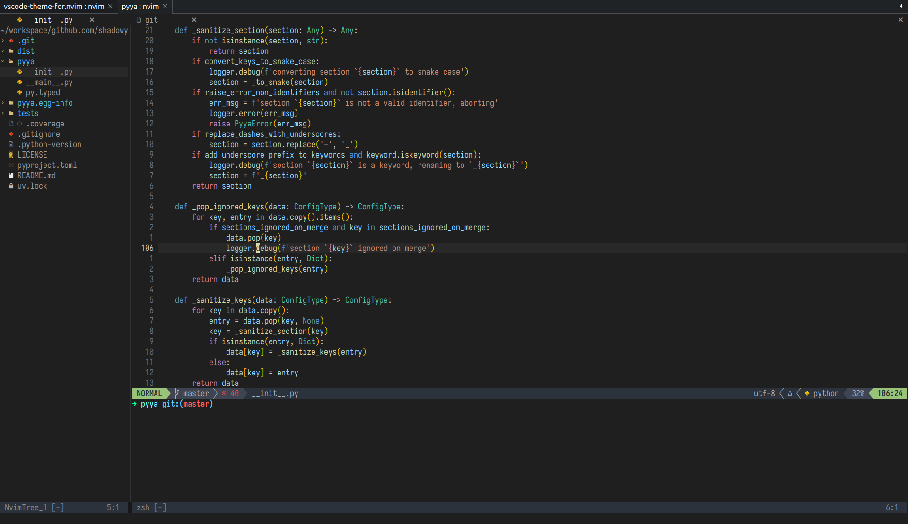

<div align="center">

# VSCode-Theme-For.nvim

VSCode-like theme for Neovim originally forked from [arctic.nvim](https://github.com/rockyzhang24/arctic.nvim).



</div>

# Installation

### [lazy.nvim](https://github.com/folke/lazy.nvim)

```lua
return {
  'shadowy-pycoder/vscode-theme-for.nvim',
  dependencies = { 'rktjmp/lush.nvim' },
  name = 'vscode-theme-for-nvim',
  branch = 'main',
  priority = 1000,
  config = function()
    vim.cmd('colorscheme vscode-theme-for-nvim')
  end,
}
```
